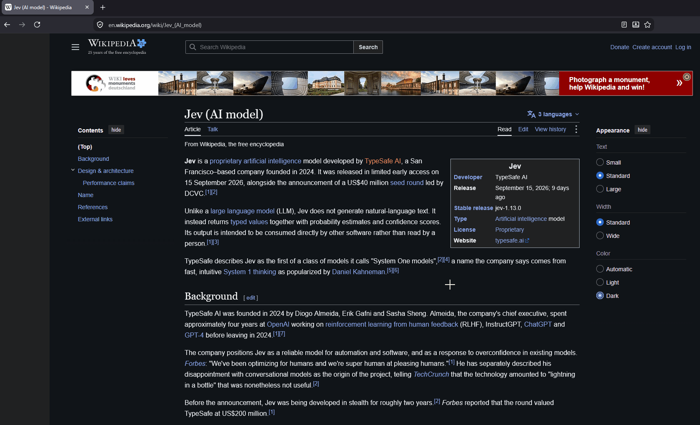

<h1 align="center">Peekr</h1>

<p align="center">
  
</p>

<p align="center">
  <a href="https://github.com/kvizyx/peekr/releases/latest"></a>
  <a href="https://github.com/kvizyx/peekr/actions/workflows/ci.yml"></a>
  <a href="LICENSE"></a>
</p>

Peekr is an offline cross-platform OCR desktop application that can extract text from screen and images. Recognition runs on local [PaddleOCR](https://github.com/PaddlePaddle/PaddleOCR) models
(PP-OCRv6 and PP-OCRv5) via ONNX Runtime.

## Preview



## Installation

Download the latest release for your platform from the [Releases](https://github.com/kvizyx/peekr/releases/latest) page.

**Windows**

- `peekr-windows-x86_64-Setup.exe`
- `peekr-windows-x86_64-Portable.zip`

**Linux**

- `peekr-<platform>.AppImage` (`linux-x86_64` or `linux-aarch64`, needs `libfuse2`)

  ```bash
  chmod +x peekr-linux-x86_64.AppImage
  ./peekr-linux-x86_64.AppImage
  ```

- `peekr-<version>-<platform>.tar.gz`

**macOS** (Apple Silicon)

- `peekr-macos-aarch64-Setup.pkg`
- `peekr-macos-aarch64-Portable.zip`

  The app is not signed, so macOS refuses to open it at first: open it from System Settings >
  Privacy & Security > Open Anyway, or clear the quarantine flag:

  ```bash
  xattr -dr com.apple.quarantine /Applications/Peekr.app
  ```

  Peekr lives in the menu bar. On the first capture macOS asks to allow it to record the screen;
  allow it in System Settings > Privacy & Security > Screen & System Audio Recording, and start
  Peekr again. The default hotkey is `Cmd+Shift+O`.

## License

This project is licensed under the [MIT License](LICENSE).

The PaddleOCR models are provided by PaddlePaddle under the Apache License 2.0. Release archives
include the licenses of the models, ONNX Runtime and all dependencies.
