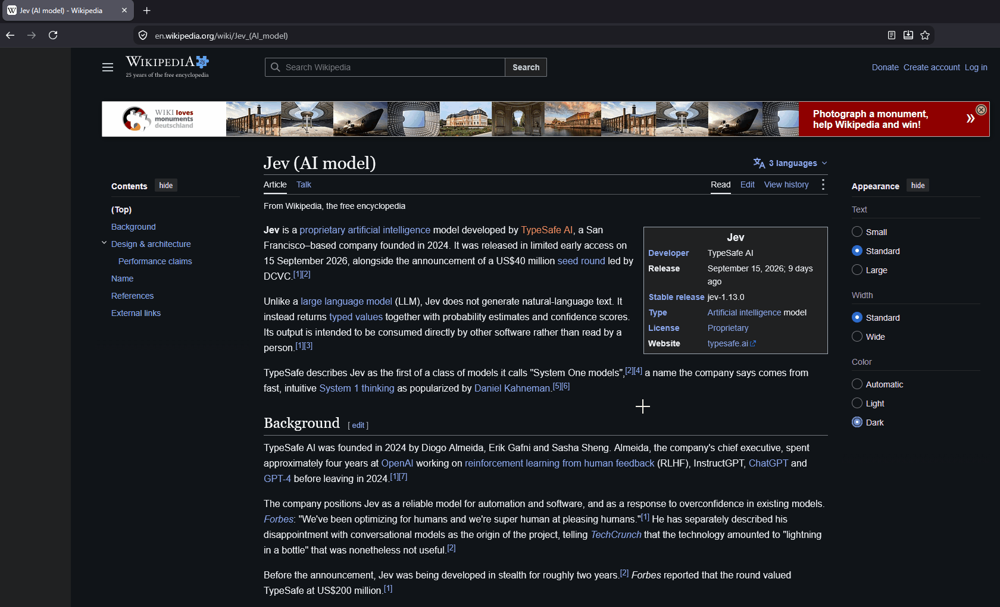

<h1 align="center">Peekr</h1>

<p align="center">
  
</p>

<p align="center">
  <a href="https://github.com/kvizyx/peekr/releases/latest"></a>
  <a href="https://github.com/kvizyx/peekr/actions/workflows/ci.yml"></a>
  <a href="LICENSE"></a>
</p>

Peekr is an offline cross-platform OCR desktop application that can extract text from screen and images. Recognition runs on local [PaddleOCR](https://github.com/PaddlePaddle/PaddleOCR) models
(PP-OCRv6 and PP-OCRv5) via ONNX Runtime.

## Preview



## Installation

Download the latest release for your platform from the [Releases](https://github.com/kvizyx/peekr/releases/latest) page.

**Windows**

- `peekr-windows-x86_64-Setup.exe`
- `peekr-windows-x86_64-Portable.zip`

**Linux**

- `peekr-<platform>.AppImage` (`linux-x86_64` or `linux-aarch64`, needs `libfuse2`)

  ```bash
  chmod +x peekr-linux-x86_64.AppImage
  ./peekr-linux-x86_64.AppImage
  ```

- `peekr-<version>-<platform>.tar.gz` (this distribution doesn't support autoupdate)

## Usage

You can use it in 2 modes - default tray app that runs in background and called by shortcut or CLI.

### Tray app

> [!NOTE]
> On Wayland apps cannot register a global hotkey themselves so you should bind `peekr --capture` to a shortcut in
> your settings instead.

The default mode. Peekr starts in it whenever it is run without arguments, and stays in the system
tray until it is quit.

### CLI

```bash
peekr                             # Start the tray app (the default)
peekr --capture                   # Select a region once, copy the text and exit
peekr --image image.png           # Print the text of an image file
peekr --list-models               # Show the models and which are installed

# Model selection, for any of the above
peekr --det pp-ocrv5-mobile       # Use this detector instead of the first installed one
peekr --rec pp-ocrv5-eslav        # Use only this recognizer
peekr --rec auto                  # Run every installed recognizer (the default)
```

With `--rec auto` each line keeps its most confident reading. `pp-ocrv5-eslav` reads Cyrillic,
`pp-ocrv6-small` reads Chinese, Japanese, English and Latin-script languages.

## License

This project is licensed under the [MIT](LICENSE) license.

The PaddleOCR models are provided by PaddlePaddle under the Apache License 2.0. Release archives
include the licenses of the models, ONNX Runtime and all dependencies.
